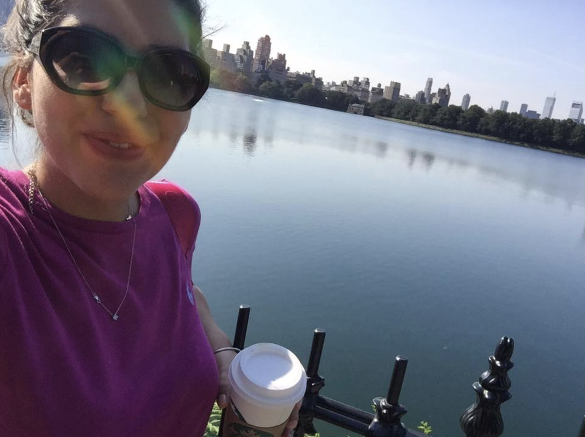

I am a Computer Science student interseted in exploring the world through science. 
Currently I am very inetersted in Neuroscience and Psychology. At the future I have a 
very clear goal to pursue a PHD in Cognitive neurosciences. At this point of my life I am trying
to make myself  more competitive for the scholarships of masters degrees I am planning to apply most probably in Germany.

Currently I am taking couple of courses, for understanding the human mind and decision making.
I have passed couple of user behaviour analytics interviews and I am waiting for the responses.
I am planning to apply for Masters degree in Mathematics in the National Academy of Sciences in Armenia. It will help me to explore the math deeper than I did during my undergraduate studies and develop skills on Machine Learning and Artificial Intelligence. 

<h2>Current Interests</h2>

<ul class="skill-list">
	<li>R for data science</li>
	<li>Python </li>
	<li>Machine Learning, AI</li>
	<li>Psychology Neuroscience </li>
	<li>Data analytics</li>
	
	<li>Exploring the world through the books of great authors</li>
</ul>